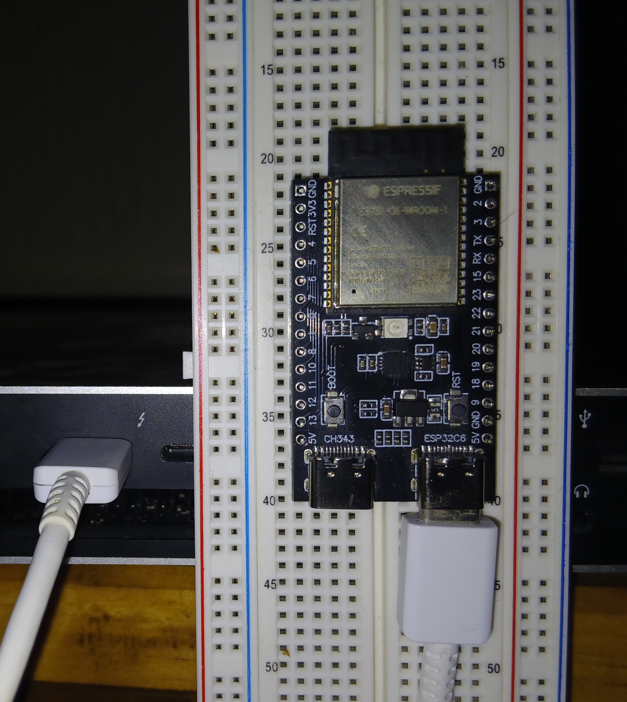

# Set Up

Now it's time to connect the host computer to the development board.

1. Plug one end of the USB to the computer's USB port.
2. Plug the other end to the board's **esp32c6**-tagged USB port (or you may see a **USB** tag.)

<div class="center w220">
<a href="../assets/usb_connection.jpg">

</a>
<p>Board-Laptop USB-link (white cable).</p>
</div>

> [!NOTE]
> The extra USB port is **UART** or **ch343**-tagged. It is used to communicate with the UART peripheral within the MCU. Both ports can be used for *flashing* and *powering*, but only **esp32c6** can be used for *debugging*.

## Check connection

To ensure our OS can detect the board, list the devices with one of these approaches:

- With `ls`

    ```bash
    ls /dev/tty*usb* # MacOS
    ```

    ```bash
    ls /dev/ttyACM*  # Linux
    ```

- With `lsusb`

    ```bash
    lsusb | grep JTAG
    # Bus (...) USB JTAG/serial debug unit (...)
    ```

## Install Software

Now that the board is seen by our OS, let's install all needed software.

### Rust Tools

1. Install the Rust toolchain following the steps in <https://rustup.rs/>
   - The Rust Toolchain is `rustup` plus many components `cargo`, `rustc`, the *compiled* `std` component and so on.
2. Add the compiled `std`-component for our *target* processor

    ```bash
    rustup target add riscv32imac-unknown-none-elf
    ```
3. Add development components:

    ```bash
    rustup component add rust-analyzer rust-src
    ```

    `rust-src` is the `std`-component's source code, used by `rust-analyzer`.

### Espressif tools

[`espflash`](https://github.com/esp-rs/espflash/tree/main/espflash) is used for flashing our ELF binary (our program) into the board.

Install `espflash` with: `cargo install espflash`

### Build dependencies

`rustc` has compilation backends which do part of the compilation of our code. `llvm` is one such possible backend (the most common one.)

- Debian/Ubuntu.

    ```bash
    sudo apt install llvm-dev libclang-dev clang
    ```

- MacOS. When using the Homebrew package manager, which we recommend:

    ```bash
    brew install llvm
    ```

## Suggested reading

- esp32 tutorial, [cross-compiling].

## Additional Software

- It's recommended to install [`Rust Analyzer`](https://rust-analyzer.github.io/), following their guide.

[cross-compiling]: https://esp32.implrust.com/std-to-no-std/cross-compilation/index.html
<!--

////// This is too advanced and kind of in detriment of learning
////// So I am commenting it out for now.

### Aside

We could install `nightly` in step `1.`; then `2.` and `3.` work the same.

But with `nightly` we can skip step `2.` and use modified `3.`

```bash
rustup component add rust-src rustfmt clippy rust-analyzer
```

`rust-src` is the *source code* of the standard library component.

Then, for each exercise/crate, we need to update `.cargo/config.toml` with:

```diff
+[unstable]
+build-std=["core"]
```

We also need to modify the `rust-toolchain.toml`:

```diff
[toolchain]
+channel = "nightly"
-channel = "stable"
components = ["rust-src"]
-targets = ["riscv32imac-unknown-none-elf"]
```

When running `cargo run --release` core will be compiled along with our crate (not used the precompiled one). However, this is *unstable* and it is only mentioned here as a cool feature.
-->
