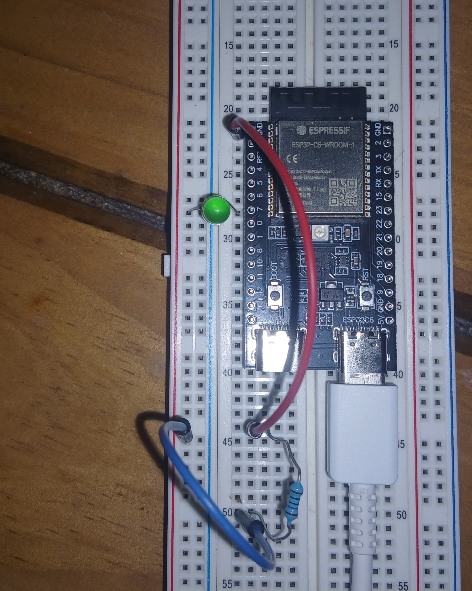

# Blinky

We will now create the iconic _blinky_.

Let's access the project with `cd exercises/blinky`.

On esp32-c6 board there is no regular LED connected, instead there is an addressable LED which works differently and is beyond the scope of this book.

Instead, we will use a regular LED and a resistor, and build a circuit controlled with the GPIO pin headers.

<div class="center w320">
<a href="../assets/led_connection.jpg">

</a>
<p>esp32-c6, wiring the LED</p>
</div>

Wire up the board as shown on the previous image:

1. Start wiring from `GND` pin header (red wire).
2. From there to the resistor (220mΩ or larger, without it the LED blows up).
3. From the other leg of the resistor to the LED (blue wire).
4. Finally, the LED connects to pin-header 7 (the long LED-leg is on 7).

Let's reconsider our boilerplate:

```rust
#![no_std]
#![no_main]

use esp_backtrace as _;
use esp_println::println;
use esp_hal::{main, Config};

esp_bootloader_esp_idf::esp_app_desc!();

fn main() -> ! {
    let peripherals = esp_hal::init(Config::default());
}
```

And now we ask ourselves:

1. Which peripheral can we use to control pin-headers' electric state?
   - We can use the `peripherals.GPIOX` where `X` is the same number than the pin-header we need.
   - In this case, it's GPIO7, labelled 7. Always check the [pinouts].
     >[!WARNING]
     > The PCB labels are written _below_ the headers!
     > So GPIO7 is **not** mapped onto header 6 (as a quick look might suggest), but on header 7.
2. Which driver can we use to communicate with it?
   - We can use the `Input` and / or `Output` drivers.

## Exercise

0. Open the file `src/main.rs`, take some time to read the code.
1. Create `OutputConfig` with default configuration.
   - Hint: it implements `Default`.
2. Toggle the `led` with 3500ms delay.

The `exercises/blinky/examples/blinky.rs` contains a solution.

You can run it with the following command `cargo run --example blinky --release`.

[pinouts]: https://docs.espressif.com/projects/esp-dev-kits/en/latest/esp32c6/_images/esp32-c6-devkitc-1-pin-layout.png
