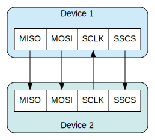

# SPI

Serial Peripheral Interface (SPI) is a communication protocol. It describes a way in which a _controller_ and one or more _targets_ can communicate.

The controller (usually a microcontroller) always initiate the communication.

As different from I2C, there are 4 communication lines.

 <!--other classes: w220, w420-->
<!--Start with `/` following path from `src`.-->
    

