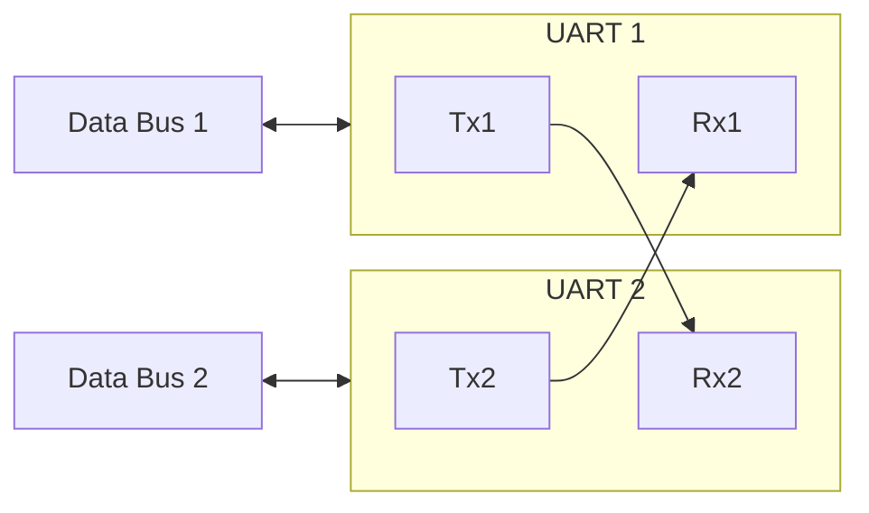
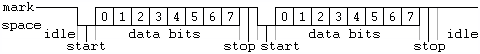

# UART - Part 1

UART stands for Universal Asynchronous Receiver and Transmitter.

_Asynchronous_ means that they don't have a dedicated clock line, since all it has is two data lines (Rx, Tx in the diagram below). This will be become more clear after learning I2C.

The diagram below shows two UARTs wired for communication; each is connected to a local data bus.

A UART has two data lines: one transmits data (Tx), one receives data (Rx). Each connects to the complementary line on the other UART. For example, the Tx1 line of UART 1, to the Rx2 line of UART 2.

The Data Bus is either where the transmitter reads data from, or where the receiver writes data to.

## Communication

Most communication _peripherals_ take the name from the communication _protocol_, but not UART. So...which protocol does the UART peripheral use?

UART uses Asynchronous Serial Communication which is an "umbrella" or general term. There isn't a subterm / protocol name. So we say: UART uses Asynchronous Serial Communication. How it works for UART is shown in the steps a bit further down.

The "Asynchronous" part was explained in the first paragraphs. "Serial Communication" means sending one bit after another; that is, in series.

- Example: Sending data from the board to the laptop. This is what happens at a high level:

    1. The sending-UART's Tx line uses START and END signals to mark when the communication starts and ends.
    2. A UART device reads a byte from the data bus.
    3. It serialises it, and wraps it with metadata bits. The whole item is now called a _frame_.
    4. Then sends the bits one-by-one to the other device (through the Tx line).

The other UART receives the series of bits (in the Rx line), uses the wrapping bits and places the data bits in the data bus.

Since there isn't a clock line, the transmission rate must be set as a parameter, called the _baud rate_, in bits per second.

Besides the baud rate, the _data_, the _parity_, and the _stop_ bits must be set equal on each device. A mismatch of speed or configuration bits will cause the devices to decode information incorrectly.

As an example:

 <!--other classes: w220, w420-->
<!--Start with `/` following path from `src`.-->
    
    
From <a href="https://en.wikipedia.org/wiki/Asynchronous_serial_communication">Asynchronous Communication</a> by <a href="https://en.wikipedia.org/wiki/User:Plugwash" class="extiw" title="en:User:Plugwash">Plugwash</a> (Public Domain)

And the description of the image (slightly modified):

> In this diagram, two bytes are sent, each consisting of a _start_ bit, followed by eight _data_ bits (bits 0-7), and one _stop_ bit, for a 10-bit character frame.
>
> The last data bit is sometimes used as a _parity_ bit.
>
> The number of data and formatting bits, the order of data bits, the presence or absence of a parity bit, the form of parity (even or odd) and the transmission speed (frequency) **must be pre-agreed** by the communicating parties.
>
> The "stop bit" is actually a "stop period"; the stop period of the transmitter may be arbitrarily long. It cannot be shorter than a specified amount, usually 1 to 2 bit times. The receiver requires a shorter stop period than the transmitter.
>
> At the end of each character, the receiver stops briefly to wait for the next start bit. It is this difference which keeps the transmitter and receiver synchronized.

## Speed Calculation

With a set up like:

- 8 _data bits_, 1 _parity_, and 1 _stop_ bit (10 bits)
    - Note: this is called a _frame_.
- _baud rate_ 115200 bits/second

It will send 11520 _frames_ per second. Since it includes 1 byte per frame (10 bits), it's also 11520 byte per second. Or 11520/1024 to get it in KiB (about 11 KiB/s). That's about 1 short essay per second.

## Suggested Reading

- [A bit more on UART][UART]: this is a short article, only looks long due to the comments section.

[UART]: https://www.circuitbasics.com/basics-uart-communication/
