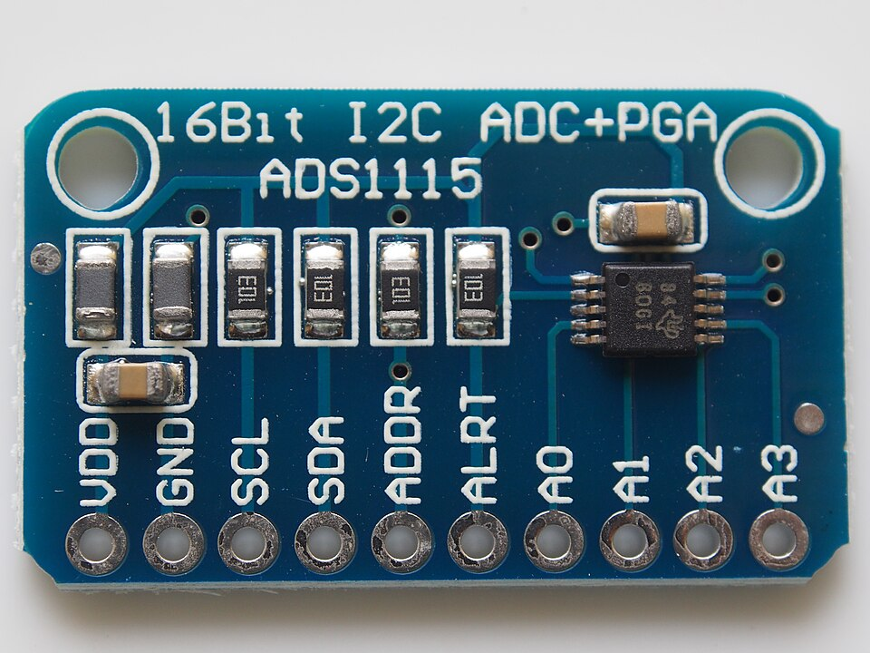
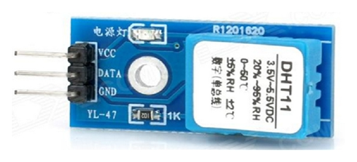

# Intro

This chapter is about communication protocols and peripherals used with them.

A _communication protocol_ is a series of steps that the devices involved agree upon, in order to encode and decode the messages exchanged (communicate).

1. Asynchronous serial communication with the UART peripheral.
2. I2C serial communication protocol and peripheral.
3. SPI serial communication protocol and peripheral.

There are many others! And sometimes devices have their own language and their datasheet must be read. But the ones listed above are very common.

## Have fun

Check out any website listing sensors, and without tempting yourself to buy things, look at which communication protocols they use. Here are a few from [Wikimedia Commons]:

- Analog to Digital Converter, uses I2C protocol.
    
 <!--other classes: w220, w420-->
    <!--Start with `/` following path from `src`.-->
        
        By <a href="https://commons.wikimedia.org/wiki/User:Pradeep717" title="User:Pradeep717">Pradeep717</a> - Own work, <a href="https://creativecommons.org/licenses/by-sa/4.0" title="Creative Commons Attribution-Share Alike 4.0">CC BY-SA 4.0</a>, <a href="https://commons.wikimedia.org/w/index.php?curid=88448335">Link</a>
    

- Barometric Pressure Sensor
    
 <!--other classes: w220, w420-->
    <!--Start with `/` following path from `src`.-->
        
        

        <a href="https://commons.wikimedia.org/wiki/File:Adafruit_BMP085_pressure_sensor_module.jpg">oomlout</a>, <a href="https://creativecommons.org/licenses/by-sa/2.0">CC BY-SA 2.0</a>, via Wikimedia Commons
        

    

- Temperature Humidity Sensor (its own protocol)
    
 <!--other classes: w220, w420-->
    <!--Start with `/` following path from `src`.-->
        
        

        <a href="https://commons.wikimedia.org/wiki/File:Temperature-humidity-sensor-module.jpg">Ji Hyoung Ryu, Muhammad Irfan, Aamir Reyaz</a>, <a href="https://creativecommons.org/licenses/by/4.0">CC BY 4.0</a>, via Wikimedia Commons
        

    

- Pressure Sensor (SPI and I2C)

    
 <!--other classes: w220, w420-->
    <!--Start with `/` following path from `src`.-->
        
        

        <a href="https://commons.wikimedia.org/wiki/File:SparkFun_Pressure_Sensor_Breakout_-_MS5803-14BA_12909.jpg">SparkFun</a>, <a href="https://creativecommons.org/licenses/by/2.0">CC BY 2.0</a>, via Wikimedia Commons
        

    

[Wikimedia Commons]: https://commons.wikimedia.org/
